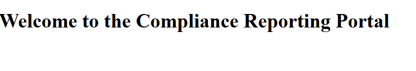

# Compliance Reporting Portal

This is a showcase project.

An enterprise-grade web application developed using **ASP.NET Core**, **React**, and **SQL Server** for automating compliance reporting processes. Built with real-world enterprise experience from projects at Johnson & Johnson and TATA Capital.

---

## 📸 Screenshot

 <!-- Replace with your actual image name -->

---

## 🚀 Tech Stack

- ASP.NET Core 6 (Web API)
- React with TypeScript
- SQL Server
- Entity Framework
- Azure DevOps (CI/CD)
- Git & GitHub

---

## 🛠️ Features

- Role-based user authentication and access
- Compliance task creation, assignment, and tracking
- Reporting dashboard with analytics
- RESTful API integrations
- Modular front-end components

---

## 📂 Folder Structure

